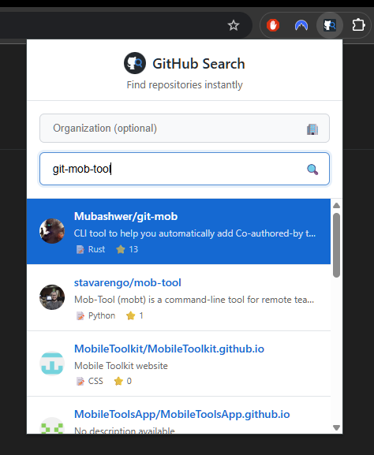

# GitHub Repo Search

A Chrome extension that allows you to quickly search GitHub repositories using the **Alt+G** keyboard shortcut, similar to the Okta Browser Plugin.



## Features

- 🔍 **Quick Search**: Press `Alt+G` from any webpage to open the search overlay
- 🏢 **Organization Search**: Search within specific GitHub organizations or across all repositories
- ⚡ **Fast Results**: Real-time search using GitHub's API
- 🎯 **Keyboard Navigation**: Use arrow keys to navigate, Enter to open repos
- 🎨 **Clean UI**: Modern, responsive design that works on any website
- 📊 **Rich Information**: Shows repository stats, language, and owner info

## Installation

### Development Install

1. Clone this repository:

   ```bash
   git clone <repository-url>
   cd github-browser-plugin
   ```

2. Install dependencies:

   ```bash
   npm install
   ```

3. Build the extension:

   ```bash
   npm run build
   ```

4. Load the extension in Chrome:
   - Open Chrome and go to `chrome://extensions/`
   - Enable "Developer mode"
   - Click "Load unpacked" and select the `dist` folder

### Production Install

The extension will be available on the Chrome Web Store once published.

## Usage

1. **Open Search**: Press `Alt+G` on any webpage
2. **Set Organization** (optional): Enter an organization name to search within (e.g., "microsoft", "google")
3. **Search**: Type your query to search GitHub repositories
4. **Navigate**: Use `↑/↓` arrow keys to select results
5. **Open**: Press `Enter` to open the selected repository in a new tab
6. **Close**: Press `Escape` to close the search overlay

### Search Tips

- Leave the organization field empty to search across all of GitHub
- Enter an organization name to search only within that organization's repositories
- The extension remembers your last searched organization for convenience

## Development

### Tech Stack

- **TypeScript** - Type-safe JavaScript
- **Vite** - Fast build tool
- **CRXJS** - Chrome extension plugin for Vite
- **Chrome Extensions Manifest V3** - Latest extension format
- **Jest** - JavaScript testing framework
- **ESLint** - JavaScript/TypeScript linter
- **Prettier** - Code formatter
- **Semantic Release** - Automated versioning and releases

### Scripts

- `npm run build` - Build production version
- `npm run dev` - Start development server with hot reload
- `npm run eslint` - Run ESLint only
- `npm run eslint:fix` - Run ESLint with automatic fixes
- `npm run format` - Format all files with Prettier
- `npm run lint` - Run type checking and ESLint
- `npm run lint:fix` - Format code, run type checking, and fix ESLint issues
- `npm run preview` - Preview production build
- `npm run release` - Create automated release with semantic-release
- `npm run test` - Run Jest unit tests
- `npm run test:watch` - Run Jest tests in watch mode
- `npm run test:coverage` - Run Jest tests with coverage report
- `npm run typecheck` - Run TypeScript type checking

### Code Quality

This project uses ESLint, Prettier, and Jest for code quality, formatting, and testing:

- **ESLint**: Lints TypeScript/JavaScript code with TypeScript-specific rules
- **Prettier**: Automatically formats code for consistent style
- **TypeScript**: Provides static type checking
- **Jest**: Unit testing framework with Chrome extension API mocking

To maintain code quality:

1. Run `npm run lint` to check for issues
2. Run `npm run lint:fix` to automatically fix most issues
3. Format code with `npm run format`
4. Run `npm test` to execute unit tests
5. Run `npm run test:coverage` to check test coverage

### Project Structure

```
src/
├── manifest.json          # Extension configuration
├── background/
│   └── index.ts          # Background script (handles shortcuts)
├── content/
│   └── index.ts          # Content script (search overlay)
└── popup/
    ├── index.html        # Extension popup UI
    └── popup.js          # Popup logic
```

## Contributing

1. Fork the repository
2. Create a feature branch: `git checkout -b feature/amazing-feature`
3. Commit your changes: `git commit -m 'feat: add amazing feature'`
4. Push to the branch: `git push origin feature/amazing-feature`
5. Open a Pull Request

## Commit Convention

This project uses [Conventional Commits](https://www.conventionalcommits.org/):

- `feat:` - New features
- `fix:` - Bug fixes
- `docs:` - Documentation changes
- `style:` - Code style changes
- `refactor:` - Code refactoring
- `test:` - Test additions/changes
- `chore:` - Maintenance tasks

## License

MIT License - see [LICENSE](LICENSE) file for details.

## Acknowledgments

- Inspired by the [Okta Browser Plugin](https://chromewebstore.google.com/detail/okta-browser-plugin/glnpjglilkicbckjpbgcfkogebgllemb)
- Built with [CRXJS](https://crxjs.dev/) Vite plugin
- Powered by the [GitHub API](https://docs.github.com/en/rest)
