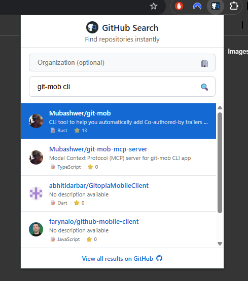

# GitHub Repo Search

A Chrome extension that allows you to quickly search GitHub repositories using the **Alt+G** keyboard shortcut, similar to the Okta Browser Plugin.

> **⚡ Quick & Dirty Prototype**: This extension was 99% "vibe-coded" as a rapid prototype to test the concept. It's functional but built quick and dirty - perfect for experimentation and learning, but don't expect production-level polish! 😄



## Features

- 🔍 **Quick Search**: Press `Alt+G` from any webpage to open the search overlay
- 🏢 **Organization Search**: Search within specific GitHub organizations or across all repositories
- ⚡ **Fast Results**: Real-time search using GitHub's API
- 🎯 **Keyboard Navigation**: Use arrow keys to navigate, Enter to open repos
- 🎨 **Clean UI**: Modern, responsive design that works on any website
- 📊 **Rich Information**: Shows repository stats, language, and owner info

## Installation

### Chrome Web Store (Recommended)

1. **Install from Chrome Web Store**:
   - Visit the [GitHub Repo Search extension page](https://chromewebstore.google.com/detail/github-repo-search/kijhcmelngcbmhjfmdbmecoblemolpon)
   - Click "Add to Chrome"
   - Confirm the installation when prompted

2. **Start using**:
   - Press `Alt+G` on any webpage to open the search overlay
   - No additional setup required!

### Download from GitHub Releases (Alternative)

1. **Download the extension**:
   - Go to the [GitHub Releases page](https://github.com/Mubashwer/github-repo-search/releases)
   - Download the latest `crx-github-repo-search-X.X.X.zip` file
   - Extract the downloaded zip file to a folder on your computer

2. **Load the extension in Chrome**:
   - Open Chrome and go to `chrome://extensions/`
   - Enable "Developer mode" (toggle in the top right)
   - Click "Load unpacked" and select the extracted folder
   - The extension should now appear in your extensions list

3. **Start using**:
   - Press `Alt+G` on any webpage to open the search overlay
   - No additional setup required!

### Development Install

1. Clone this repository:

   ```bash
   git clone <repository-url>
   cd github-browser-plugin
   ```

2. Install dependencies:

   ```bash
   npm install
   ```

3. Build the extension:

   ```bash
   npm run build
   ```

4. Load the extension in Chrome:
   - Open Chrome and go to `chrome://extensions/`
   - Enable "Developer mode"
   - Click "Load unpacked" and select the `dist` folder

## Usage

1. **Open Search**: Press `Alt+G` on any webpage
2. **Set Organization** (optional): Enter an organization name to search within (e.g., "microsoft", "google")
3. **Search**: Type your query to search GitHub repositories
4. **Navigate**: Use `↑/↓` arrow keys to select results
5. **Open**: Press `Enter` to open the selected repository in a new tab
6. **Close**: Press `Escape` to close the search overlay

### Search Tips

- Leave the organization field empty to search across all of GitHub
- Enter an organization name to search only within that organization's repositories
- The extension remembers your last searched organization for convenience

## Development

### Tech Stack

- **TypeScript** - Type-safe JavaScript
- **Vite** - Fast build tool
- **CRXJS** - Chrome extension plugin for Vite
- **Chrome Extensions Manifest V3** - Latest extension format
- **Jest** - JavaScript testing framework
- **ESLint** - JavaScript/TypeScript linter
- **Prettier** - Code formatter
- **Semantic Release** - Automated versioning and releases

### Automated Releases

This project uses semantic-release with GitHub Actions for automated releases:

- **Conventional Commits**: Follow the commit convention for automatic version bumping
- **GitHub Releases**: Automatically created on pushes to main branch
- **Extension Packages**: Built extension zips are attached to each release
- **CI/CD Pipeline**: Automated testing, building, and deployment

### Scripts

- `npm run build` - Build production version
- `npm run dev` - Start development server with hot reload
- `npm run eslint` - Run ESLint only
- `npm run eslint:fix` - Run ESLint with automatic fixes
- `npm run format` - Format all files with Prettier
- `npm run lint` - Run type checking and ESLint
- `npm run lint:fix` - Format code, run type checking, and fix ESLint issues
- `npm run preview` - Preview production build
- `npm run release` - Create automated release with semantic-release
- `npm run test` - Run Jest unit tests
- `npm run test:watch` - Run Jest tests in watch mode
- `npm run test:coverage` - Run Jest tests with coverage report
- `npm run typecheck` - Run TypeScript type checking

### Code Quality

This project uses ESLint, Prettier, and Jest for code quality, formatting, and testing:

- **ESLint**: Lints TypeScript/JavaScript code with TypeScript-specific rules
- **Prettier**: Automatically formats code for consistent style
- **TypeScript**: Provides static type checking
- **Jest**: Unit testing framework with Chrome extension API mocking

To maintain code quality:

1. Run `npm run lint` to check for issues
2. Run `npm run lint:fix` to automatically fix most issues
3. Format code with `npm run format`
4. Run `npm test` to execute unit tests
5. Run `npm run test:coverage` to check test coverage

### Project Structure

```
src/
├── manifest.json          # Extension configuration
├── background/
│   └── index.ts          # Background script (handles shortcuts)
├── content/
│   └── index.ts          # Content script (search overlay)
└── popup/
    ├── index.html        # Extension popup UI
    └── popup.js          # Popup logic
```

## Contributing

1. Fork the repository
2. Create a feature branch: `git checkout -b feature/amazing-feature`
3. Commit your changes: `git commit -m 'feat: add amazing feature'`
4. Push to the branch: `git push origin feature/amazing-feature`
5. Open a Pull Request

## Commit Convention

This project uses [Conventional Commits](https://www.conventionalcommits.org/):

- `feat:` - New features
- `fix:` - Bug fixes
- `docs:` - Documentation changes
- `style:` - Code style changes
- `refactor:` - Code refactoring
- `test:` - Test additions/changes
- `chore:` - Maintenance tasks

## Disclaimer

This project was built as a quick prototype to explore Chrome extension development and GitHub API integration. It's intentionally "vibe-coded" - meaning it prioritizes getting something working quickly over perfect architecture or comprehensive error handling.

**What this means:**

- 🏃‍♂️ **Built for speed**: Quick iteration over perfect code structure
- 🧪 **Experimental**: Great for learning and testing concepts
- 🔧 **Functional**: It works, but there's room for improvement
- 📚 **Educational**: Perfect for understanding Chrome extension basics

Feel free to fork, improve, and make it more robust! Pull requests welcome. 🚀

## Security Considerations

This extension handles GitHub personal access tokens and makes API requests. Here are the current security considerations and trade-offs:

### **🔐 Token Storage**

- **Current**: Tokens stored in plain text using Chrome's `storage.local` API
- **Security**: Chrome sandboxes extension storage (other extensions/websites can't access it)
- **Trade-off**: Plain text vs. encryption complexity - acceptable for prototype, could be enhanced for production

### **🎯 Token Permissions**

- **Public repositories**: No authentication required, but token improves rate limits (60 → 5,000 requests/hour)
- **Private repositories**: Requires `repo` scope (full repository access - GitHub doesn't offer read-only for private repos)
- **Current scope**: Extension requests full `repo` access for private repository search
- **Usage**: Extension only performs repository searches, never modifies data

### **📡 Network Security**

- **HTTPS only**: All GitHub API requests use HTTPS
- **No external servers**: Tokens never sent to third-party servers
- **Client-side only**: All processing happens in the browser extension

### **🛡️ Chrome Extension Security**

- **Manifest V3**: Uses latest Chrome extension security model
- **Minimal permissions**: Only requests necessary Chrome APIs
- **Content Security Policy**: Default CSP protections in place
- **Extension isolation**: Runs in isolated context from web pages

### **⚠️ Known Limitations**

- **Local access**: Users with file system access could potentially read stored tokens
- **No token expiration**: Tokens don't automatically expire (relies on GitHub's token management)
- **Full repo scope**: Private repository search requires broader permissions than ideal

### **🔒 Recommendations for Production Use**

- Implement token encryption with key derivation
- Add token expiration and refresh mechanisms
- Consider OAuth flow instead of personal access tokens
- Add option to clear stored credentials
- Implement more granular permission explanations

_For a quick prototype, the current approach balances functionality with reasonable security practices._

## License

MIT License - see [LICENSE](LICENSE) file for details.

## Acknowledgments

- Inspired by the [Okta Browser Plugin](https://chromewebstore.google.com/detail/okta-browser-plugin/glnpjglilkicbckjpbgcfkogebgllemb)
- Built with [CRXJS](https://crxjs.dev/) Vite plugin
- Powered by the [GitHub API](https://docs.github.com/en/rest)
